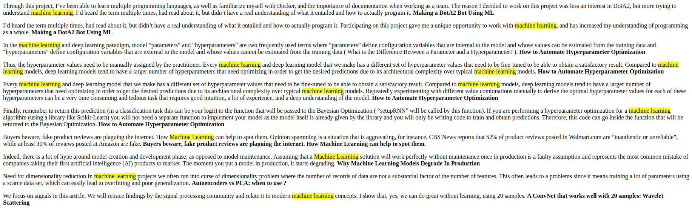

# Article Retrieval System

This project aims to retrieve relevant fragments of articles based on user-provided keywords. The system indexes a dataset of articles, allowing users to search for specific.

## Output File

The program generates an HTML file named "fragments.html" containing the retrieved fragments. Each fragment is displayed as a paragraph, with the search keyword highlighted in yellow. Additionally, the title of the article from which the fragment originates is displayed in bold at the end of each paragraph.

## Features

- **Keyword Highlighting**: The program highlights the search keyword within each fragment for better visibility.
- **Contextual Fragments**: Each fragment consists of three sentences, with the middle sentence containing the search keyword.
- **Article Title Display**: The title of the article from which each fragment is extracted is displayed in bold for reference.

## Dependencies

To run the program, ensure the following libraries are installed:

- `pandas` (pip install pandas)
- `nltk` (pip install nltk)
- `scikit-learn` (pip install scikit-learn)

## How to Run

1. Clone the repository or download the project files.
2. Ensure the dataset file ("medium.csv") is available in the project directory.
3. Install the required dependencies listed above.
4. Run the program using Python.
5. Enter the keyword when prompted.
6. Open the generated HTML file ("fragments.html") to view the retrieved fragments (for example in Chrome).

## Future Development

- **Enhanced Preprocessing**: Integration of Named Entity Recognition (NER) and domain-specific stopword lists.
- **User Interface**: Developing an interactive dashboard with advanced filtering options for a better user experience.
